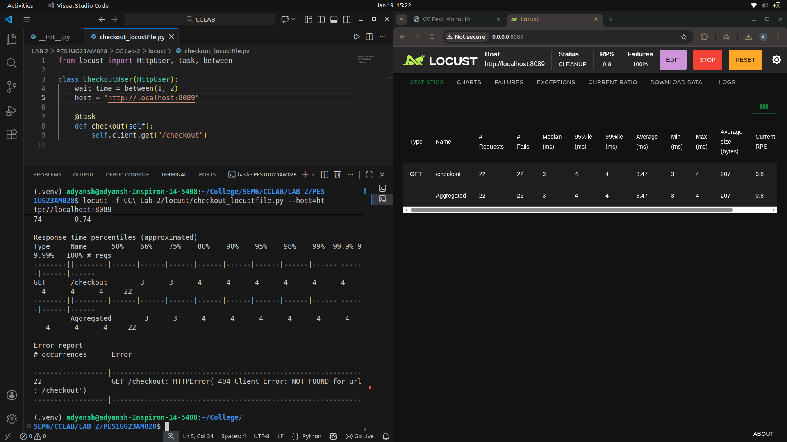
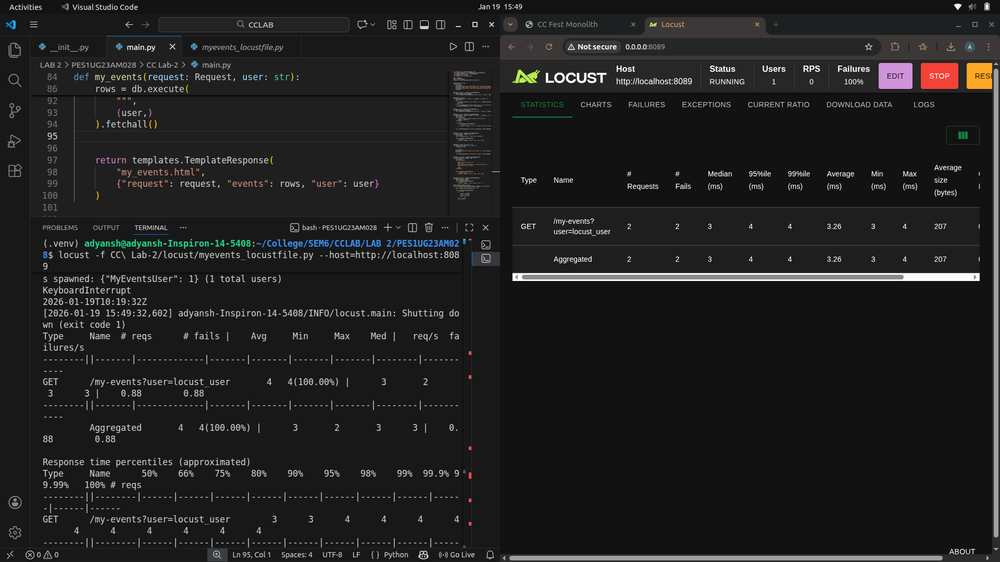
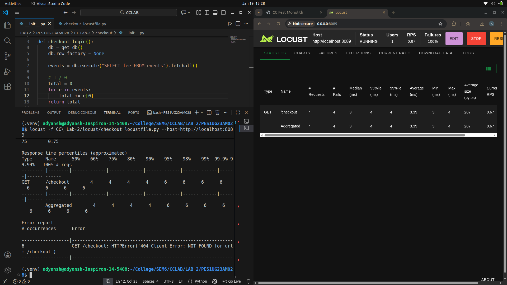
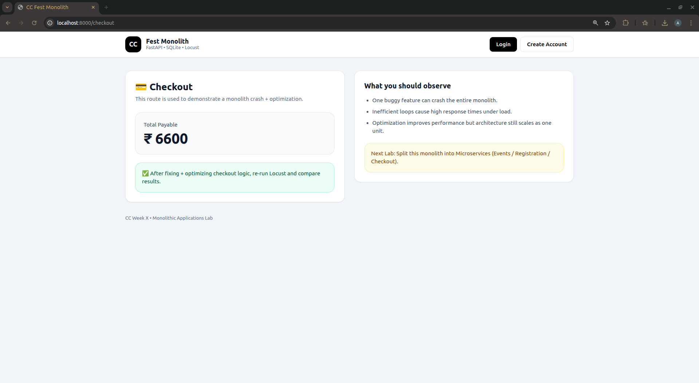
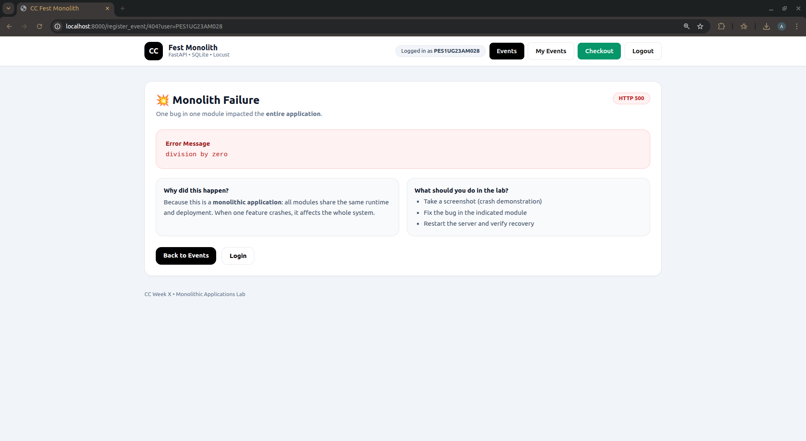
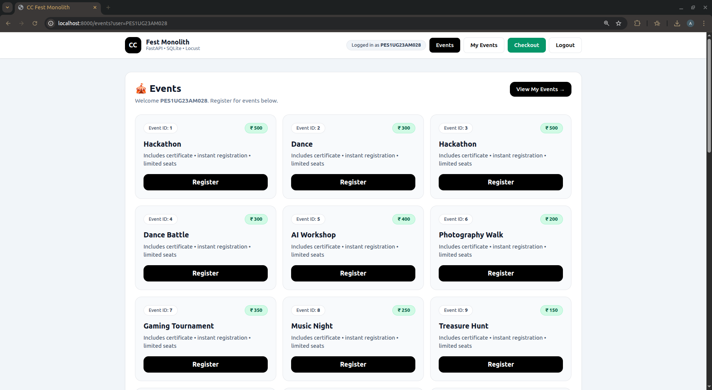
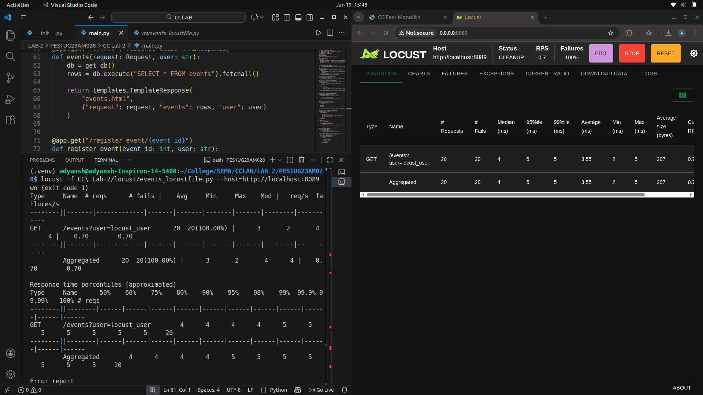
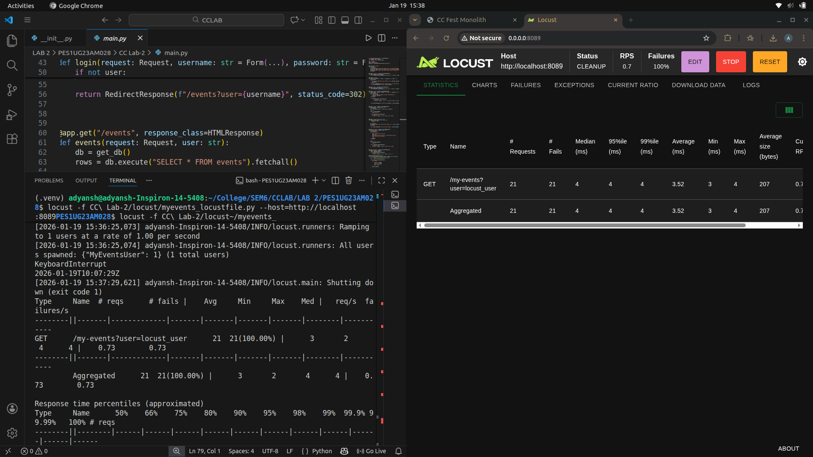

# CC \- LAB 2 \- Monolithic Architectures

| Name \t | Adyansh Aggarwal |
| :---- | :---- |
| **SRN** \t| **PES1UG23AM028** |
| **Section** \t| **AIML \- A** |

## SS1- Events page loaded


## SS2 \- Monolithic Failure (Crash)  


## SS3 \- Fixed Bug  
  

## SS4 \- Locust measurements  


## SS5 \- Post optimization   
 

## SS6 \- Before events optimization  


## SS7 \- after events optimization  
  

## SS8 \- Before myevents optimization  


## SS9 \- After events optimization
  

## Code Optimizations (in main.py) 

### Route 1: /events

- **Bottleneck:** Artificial CPU-intensive loop

```python
waste \= 0

for i in range(3000000):

    waste \+= i % 3
```

- **Issue:** Blocks request handling, increases latency, reduces throughput (high RT in Locust)

- **Changes made:** Removed unnecessary computation

- **Improvement:** Route now performs only required DB fetch and template rendering

- **Why performance improved:** Reduced CPU time per request implies faster responses and better concurrency

### Route 2: /my-events

- **Bottleneck:** Unnecessary dummy loop (similar to /events)

```python
dummy \= 0

for \_ in range(1500000):

    dummy \+= 1

```

- **Issue:** Wastes CPU cycles and delays every request (higher average RT in Locust)

- **Changes made:** Removed unnecessary computation

- **Improvement:** Route performs only DB join and rendering

- **Why performance improved:** Reduced CPU time per request implies faster responses and better concurrency